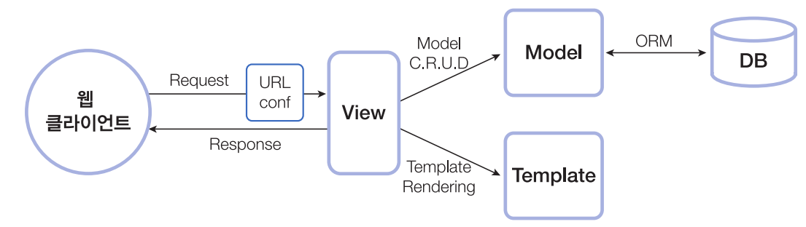

# 🤔 Django의 MVT 패턴에 대해서 알아보자

웹 프로그래밍 시 일반적으로 언급되는 데이터(Model), 사용자 인터페이스(View), 데이터를 처리하는 로직(Controller)을 구분해서  
한 요소가 다른 요소들에게 영향을 주지 않도록 설계하는 방식을 의미합니다.

이런 방식으로 개발을 진행하면 UI 디자이너는 데이터 관리나 애플리케이션 로직에 크게 신경 쓰지 않고도 화면 UI를 설계할 수 있고 로직이나  
데이터를 설계하는 개발자도 화면 디자인은 디자이너에게 맡기고 자신의 설계 및 개발 업무에만 집중할 수 있습니다. 파이썬도 이러한 MVC 패턴틔 개념을 그대로 받아들였는데 용어는 다르게 사용합니다.

## 👉 Model View Template

모델 Model은 데이터베이스에 저장되는 데이터를, 템플릿Template은 사용자에게 보이는 UI 부분을 의미하며, 뷰 View는 실질적으로 프로그램 로직이 동작하여 데이터를 가져오고 적절하게 처리한 결과를 템플릿에 전달하는 역할을 수행합니다.

웹 클라이언트의 요청을 받아 장고에서 MVT 패턴에 맞게 처리하는 과정을 요약하면 다음과 같습니다.

- 클라이언트로부터 요청을 받으면 URLconf를 이용하여 URL을 분석합니다.
- URL 분석 결과를 바탕으로 해당 URL 처리를 담당할 뷰를 결정합니다.
- 뷰는 자신의 로직을 실행하면서 만일 데이터베이스 처리가 필요하면 모델을 통해 처리하고 그 결과를 반환받습니다.
- 뷰는 자신의 로직 처리가 끝나면 템플릿을 사용하여 클라이언트에 전송할 HTML 파일을 생성합니다.
- 뷰는 최종 결과로 HTML 파일을 클라이언트에게 보내 응답합니다.

## 👉 Model - 데이터베이스 정의

모델이란 사용될 데이터에 대한 정의를 담고 있는 장고의 클래스 입니다. 장고에서는 ORM 기법을 바탕으로 애플맄이션에서 사용할 데이터베이스를 클래스로 매핑하여 코딩할 수 있습니다.

즉, 하나의 모델 클래스는 하나의 테이블에 매핑되고, 모델 클래스의 속성은 테이블의 컬럼에 매핑됩니다.  
이렇게 ORM 기법을 사용하여 테이블을 클래스로 매핑하면 애플리케이션에서는 데이터베이스로의 액세스를 SQL 없이도 클래스를 다루는 것처럼 할 수 있어서 편리합니다.

## 👉 View - 로직 정의

장고는 웹 요청에 있는 URL을 분석하고 그 결과로 해당 URL에 매핑된 뷰를 호출합니다.

일반적으로 뷰는 웹 요청을 받아서 데이터베이스 접속 등 해당 애플리케이션의 로직에 맞는 처리를 하고 그 결과 데이터를 HTML로 변환하기 위해 템플릿 처리를 한 후  
최종 HTML로 된 응답 데이터를 웹 클라이언트로 반환합니다. 장고에서 뷰는 함수 또는 클래스의 메소드로 작성되며 웹 요청을 받고 응답을 반환합니다.

여기서 응답은 HTML 데이터일 수도 있고, 리다이렉션 명령일 수도 있고, 404 에러 메시지일 수도 있습니다. 다양한 형태의 응답 데이터를 만드는 로직을 뷰에 작성하는 것입니다.

이러한 뷰는 보통 views.py 파일에 작성하지만, 원한다면 다른 파일에 작성해도 무방합니다. 다만 파이썬 경로에 있는 파일이어야 장고가 찾을 수 있습니다.

## 👉 Template - 화면 UI 정의

Django에서 "Template"은 화면(UI)을 정의하기 위한 파일로, 사용자에게 보여지는 웹 페이지의 구조, 레이아웃, 그리고 동적인 데이터를 표현하는데 사용됩니다. Django는 기본적으로 HTML을 사용하며, 이를 템플릿 엔진을 통해 동적으로 처리할 수 있도록 지원합니다.

주로 다음과 같은 특징을 가지고 있습니다.

1. 템플릿 언어(Template Language): Django에서는 자체적인 템플릿 언어를 제공합니다.
   이 언어를 사용하여 변수, 제어문(if문, for문), 필터 등을 통해 동적인 내용을 템플릿에 삽입할 수 있습니다.

2. 상속(Inheritance): 템플릿 상속을 통해 기본 템플릿을 정의하고, 이를 확장하여 각 페이지마다 필요한 부분만을 추가하거나 수정할 수 있습니다.

3. 템플릿 태그(Template Tags): Django는 템플릿 태그를 통해 서버 측 로직을 템플릿에서 수행할 수 있습니다. 예를 들어, 반복문이나 조건문을 템플릿에서 직접 사용할 수 있습니다.

4. 정적 파일 관리: 템플릿은 정적 파일(이미지, CSS, JavaScript 등)과 함께 사용되어 외부 리소스를 로드할 수 있습니다.

# 🗂️ MVT 코딩 순서

모델, 뷰, 템플릿 셋 중에서 무엇을 먼저 코딩해야 하는지에 관해 정해진 순서는 없습니다. MVT 방식에 따르면 화면 설계는 뷰와 템플릿 코딩으로 연결되고 테이블 설계는 모델 코딩에 반영됩니다. 뷰와 템플릿은 서로 영향을 미치므로 독립적으로 개발할 수 있는 모델을 먼저 코딩하고 그 후 뷰와 템플릿을 같이 코딩하는 것이 일반적입니다.

뷰와 템플릿의 코딩 순서도 굳이 정할 필요는 없지만, UI 화면을 생각하면서 로직을 풀어 나가는 것이 쉽기 때문에 보통은 템플릿을 먼저 코딩합니다.  
다만 클래스형 뷰CBV, Class-Based View처럼 뷰의 코딩이 매우 간단한 경우에는 뷰를 먼저 코딩한 다음 템플릿을 코딩합니다.

함수형 뷰를 사용하는 경우 모델, 템플릿, 뷰 순서로 코딩을 진행합니다(클래스형 뷰를 사용하는 경우에는 모델, 뷰, 템플릿 순서로 코딩을 진행합니다.).  
프로젝트 설정 파일 및 URLConf 파일까지 포함한 코딩 순서를 정리하면 다음과 같습니다.

1. 프로젝트 뼈대 만들기 : 프로젝트 및 애플리케이션 프로그래밍에 필요한 디렉터리와 파일 생성
2. 모델 코딩하기 : 테이블 관련 사항을 프로그래밍(models.py, admin.py 파일)
3. URLconf 코딩하기 : URL 및 뷰 매핑 관계를 정의(urls.py 파일)
4. 템플릿 코딩하기 : 화면 UI 프로그래밍(templates/ 디렉터리 하위의 \*.html 파일들)
5. 뷰 코딩하기 : 애플리케이션 로직 프로그래밍(views.py 파일)
