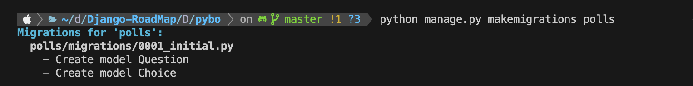

# ❓ 장고 모델이 뭐임 ❓

메타 데이터를 포함하고 있는 데이터베이스의 레이아웃인 아주 중요한 역할을 하는 기능입니다.

> 🧐 **장고의 철학**
> 모델은 데이터베이스에 저장하기 위한 데이터의 기초입니다. 모델은 저장할 데이터의 중요한 필드와 데이터 형식 등을 가집니다.
>
> 모델은 마이그레이션 파일을 포함하고 있습니다. `Ruby On Rails`와는 다르게 모델 파일을 통해 마이그레이션 파일을 만듭니다.  
> 기본적으로 이 마이그레이션 파일은 데이터베이스를 모델에 맞춰 업데이트를 하기 위한 기록 정도라고 볼 수 있습니다.

## 🧑🏻‍💻 모델 작성하기...

단순한 투표 앱을 위해서 `Question`과 `Choice`라는 모델을 만들어보도록 하겠습니다.

A. `Question` 모델은 질문과 공개 날짜 필드를 가지고 있습니다.
B. `Choice` 모델은 하나의 `Question` 모델과 관계가 있습니다.

### 🤔 Model의 Field ❓

최종적으로 설계하기 전에 장고의 모델(db)에는 다양한 필드가 존재합니다.

1. **AutoField** : ID(pk)로 사용 가능한 자동으로 증가하는 `IntegerField` 입니다.
   직접 사용할 필요는 없습니다. 모델의 기본키 필드는 별도로 지정하지 않으면 자동으로 추가됩니다.
2. **CharField** : 제한된 문자열 필드 타입. 최대 길이를 max_length 옵션에 지정해야 됩니다.

   문자열의 특별한 용도에 따라 CharField의 파생클래스로서, 이메일 주소를 체크를 하는 EmailField, IP 주소를 체크를 하는 GenericIPAddressField 등이 있습니다.

3. **TexTField** : 대용량 문자열을 갖는 필드입니다.
4. **BooleanField** : true/false 필드. Null을 허용하기 위해서는 NullBooleanField를 사용합니다.

위와 같은 필드 타입 클래스 이외에, DJango 프레임워크는 테이블 간 혹은 필드 간 관계(Relationship)을 표현하기 위해 ForeignKey, ManyToManyFiedl, OneToOneField 클래스를 또한 제공하고 있습니다.

그리고 이 밖에도 다양한 필드들이 있으며 더 확인하고 싶으시면 아래 링크를 확인해주세요.

> [<a href="https://docs.djangoproject.com/en/5.0/ref/forms/fields/#booleanfield">[Built-in Field classes]</a>

## ✨ 모델을 만들보자 ❗️

```python
from  django.db import models

class Question(models.Model):
    question_text = models.CharField(max_length=200)
    pub_date = models.DateTimeField('date published')

class Choice(models.Model):
    question = models.ForeignKey(Question, on_delete=models.CASCADE)
    choice_text = models.CharField(max_length=200)
    votes = models.IntegerField(default=0)
```

각 모델은 `django.db.models.Model` 모델의 서브 모델입니다. ex) `Question`, `Choice`  
각 모델은 클래스 변수를 포함하고, 각각의 클래스 변수는 모델 데이터가 저장될 데이터베이스의 필드와 같습니다.  
데이터베이스의 필드는 모델 클래스안에 정의되는 `Field` 클래스의 오브젝트와 같습니다.

ex) 캐릭터 필드를 위한 `CharField`, 날짜를 위한 `DateTimeField` 이것들이 장고에게 각 필드에 어떤 형식에 데이터가 저장될 것인지 알려줍니다.

ForeignKey를 사용하여 두 클래스간에 관계를 정의한 것을 알 수가 있습니다. 이런식으로 장고에게 각 Choice 클래스가 하나의 Question. 클래스와 관계가 있다는 것을 알려줍니다.

## 🏃‍♀️ 모델의 활성화

다음과 같은 몇 줄 안되는 모델 코드는 장고에게 아주 많은 정보를 알려 줍니다. 이 코드를 통해 장고는 아래와 같은 기능들을 수행할 수 있습니다.

- 이 앱의 데이터베이스 스키마 생성(`CREATE TABLE` statements)
- Question 과 Choice 오브젝트에 액세스 할 수 있는 Python-database-access API 생성

### 🤔 어떻게?

> 장고 앱은 **모듈식** 입니다. 다른 프로젝트에서 사용할 수도 있으며, 다른 사람들에게 패키지로써 제공할 수도 있습니다.

`/settings.py` 파일을 다음과 같이 수정해줍니다. <a href="https://docs.djangoproject.com/en/1.10/ref/settings/#std:setting-INSTALLED_APPS">`INSTALLED_APPS`</a> 셋팅에 `'polls.apps.PollsConfig'`를 다음과 같이 추가하여 주십시오.

```python
INSTALLED_APPS = [
    'polls.apps.PollsConfig',
    'django.contrib.admin',
    'django.contrib.auth',
    'django.contrib.contenttypes',
    'django.contrib.sessions',
    'django.contrib.messages',
    'django.contrib.staticfiles',
]
```

`INSTALLED_APPS`에 추가한 `'polls.apps.PollsConfig'` 클래스는 `polls/apps.py` 파일에 있는 클래스입니다. 이 파일은 `polls` 앱 생성시 자동으로 만들어지는 파일로 따로 만들 필요가 없습니다.

이제 장고에게 `polls` app이 설치되어 있음을 알려 주었습니다. 다음 명령어를 실행해주세요
`$ python manage.py makemigrations polls`

다음과 같이 출력되는 것을 볼 수 있을 겁니다.

```lua
Migrations for 'polls':
  polls/migrations/0001_initial.py:
    - Create model Choice
    - Create model Question
    - Add field question to choice
```



`makemigrations`, 명령어를 실행하여 장고에게 새로 추가한 파일이나 변경된 파일이 있음을 알려주고, 변경된 내용을 migration 파일로써 저장하도록 합니다.  
**마이그레이션** 은 모델의 변경내용이 디스크상에 저장되는 단순한 파일입니다. 또한 이 마이그레이션은 필요에 따라 직접 수정하여 사용할 수 있습니다.

마이그레이션 파일이 만들어 졌지만, 아직 데이터베이스 스키마를 만들지는 않았습니다.  
데이터베이스 스키마를 자동으로 관리해주는 명령어가 있는데 그것이 <a href="https://docs.djangoproject.com/en/1.10/ref/django-admin/#django-admin-migrate">`migrate`</a> 입니다.

<a href="https://docs.djangoproject.com/en/1.10/ref/django-admin/#django-admin-sqlmigrate">`sqlmigrate`</a> 명령어는 실제로 SQL 명령어를 실행하지는 않고 실행될 내용만을 보여줍니다.  
이 명령어는 마이그레이션 이름을 파라메터로 받고 실행될 SQL을 리턴하여 줍니다.

`$ python manage.py sqlmigrate polls 0001`

그럼 다음과 같이 출력 되는 것을 확인할 수 있습니다.

```lua
BEGIN;
--
-- Create model Question
--
CREATE TABLE "polls_question" ("id" integer NOT NULL PRIMARY KEY AUTOINCREMENT, "question_text" varchar(200) NOT NULL, "pub_date" date NOT NULL);
--
-- Create model Choice
--
CREATE TABLE "polls_choice" ("id" integer NOT NULL PRIMARY KEY AUTOINCREMENT, "choice_text" varchar(200) NOT NULL, "votes" integer NOT NULL, "question_id" bigint NOT NULL REFERENCES "polls_question" ("id") DEFERRABLE INITIALLY DEFERRED);
CREATE INDEX "polls_choice_question_id_c5b4b260" ON "polls_choice" ("question_id");
COMMIT;
```
